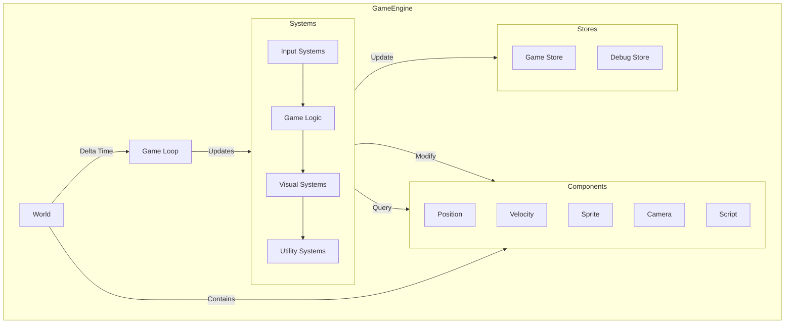

# ECS Game Engine

A high-performance Entity Component System (ECS) game engine built with TypeScript and [BitECS](https://github.com/NateTheGreatt/bitecs). This engine powers the game's core systems using a data-oriented design approach.

## Architecture Overview

The engine is built on three main concepts:

1. **Entities**: Simple numeric IDs that represent game objects
2. **Components**: Pure data containers attached to entities
3. **Systems**: Logic that processes entities with specific components



## Core Systems

The engine includes several core systems that run in a specific order each frame:

- Input Systems
  - Keyboard: Handles keyboard input
  - Mouse: Processes mouse events and positions
- Game Logic
  - Movement: Updates entity positions
  - Physics: Handles collisions and physics calculations
  - Trigger: Manages interaction zones and events
  - Script: Executes custom entity behaviors
- Visual Systems
  - Sprite: Manages sprite states and animations
  - Animation: Handles sprite animation frames
  - Particle: Controls particle effects
  - Scene: Manages game scenes and transitions
  - Camera: Controls viewport and following behavior
  - Render: Draws all visible entities to canvas
- Utility Systems
  - Debug: Provides debugging information
  - Sound: Handles audio playback

## Game Loop

The engine runs at 60 FPS and processes systems in sequence:

1. Calculates delta time between frames
2. Updates each system in order
3. Updates game and debug stores with performance metrics
4. Schedules next frame

## Usage

```typescript
// Create a new game engine instance
const engine = new GameEngine(canvas, gameStore, debugStore);

// Start the game loop
engine.start();

// Stop the game loop
engine.stop();

// Clean up resources
engine.cleanup();
```

## World Creation

The world is initialized with:

- A player entity at the center
- NPCs randomly positioned on a grid
- Trigger zones for game events
- A camera entity following the player
- Scene and ground entities

## Performance

The engine uses BitECS for optimal performance:

- Components are stored in typed arrays
- Systems operate on contiguous memory
- Minimal garbage collection impact
- Performance metrics for each system

## Debug Tools

Debug features include:

- System performance monitoring
- Entity inspection
- Visual debugging overlays
- System enable/disable toggles

## Contributing

### Development Environment Setup

1. **Prerequisites**

   - Node.js 18+
   - TypeScript 5.0+
   - A modern browser with canvas support
   - Vitest for testing

2. **Project Structure**
   ```
   lib/ecs/
   ├── components.ts     # Component definitions
   ├── engine.ts        # Core engine implementation
   ├── world.ts         # World creation and management
   ├── types.ts         # TypeScript type definitions
   ├── entities/        # Entity factories
   ├── systems/         # System implementations
   │   ├── animation/
   │   ├── physics/
   │   ├── render/
   │   └── __tests__/   # System tests
   └── utils/           # Helper utilities
   ```

### Adding New Features

#### Creating New Components

1. Define the component in `components.ts`:

   ```typescript
   export const NewComponent = {
     _name: "NewComponent",
     value1: new Float32Array(1000), // 32-bit float
     value2: new Uint8Array(1000), // 8-bit unsigned int
     value3: new Uint32Array(1000), // Entity ID reference
   } as const;
   ```

2. Add TypeScript types:
   ```typescript
   export interface NewComponentData {
     value1: number;
     value2: number;
     value3: number;
   }
   ```

#### Implementing New Systems

1. Create a new system file in `systems/`:

   ```typescript
   import { query } from "bitecs";

   import { NewComponent } from "../components";

   export function createNewSystem() {
     return function newSystem(world: World, deltaTime: number) {
       // Process all matching entities
       const entities = query(world, [NewComponent]);
       for (const eid of entities) {
         // Update entity state
         NewComponent.value1[eid] += deltaTime;
       }

       return world;
     };
   }
   ```

2. Register the system in `engine.ts`:
   ```typescript
   this.systems = [
     // ... existing systems ...
     createNewSystem(),
   ];
   ```

#### Creating Entity Factories

1. Add a new factory in `entities/`:

   ```typescript
   import { addComponent } from "bitecs";

   import { NewComponent } from "../components";

   export interface CreateNewEntityProps {
     x: number;
     y: number;
     // ... other properties
   }

   export function createNewEntity(world: World, props: CreateNewEntityProps) {
     const eid = addEntity(world);

     addComponent(world, eid, NewComponent);
     NewComponent.value1[eid] = props.x;
     NewComponent.value2[eid] = props.y;

     return eid;
   }
   ```

### Testing

#### Unit Testing Systems

1. Create test file in `systems/__tests__/`:

   ```typescript
   import { createWorld } from "bitecs";
   import { beforeEach, describe, expect, it } from "vitest";

   import { NewComponent } from "../../components";
   import { createNewSystem } from "../new-system";

   describe("NewSystem", () => {
     let world: World;
     let system: ReturnType<typeof createNewSystem>;

     beforeEach(() => {
       world = createWorld();
       system = createNewSystem();
     });

     it("should update component values", () => {
       const eid = addEntity(world);
       addComponent(world, NewComponent, eid);
       NewComponent.value1[eid] = 0;

       system(world, 1.0);

       expect(NewComponent.value1[eid]).toBe(1.0);
     });
   });
   ```

2. Run tests:
   ```bash
   pnpm test
   # or for specific tests:
   pnpm test systems/__tests__/new-system.test.ts
   ```

### Debugging

#### Performance Profiling

1. Enable system performance monitoring:

   ```typescript
   const engine = new GameEngine(canvas, gameStore, debugStore);
   debugStore.enableSystemMetrics = true;
   ```

2. View metrics in the debug overlay or console:
   ```typescript
   console.table(debugStore.systemPerformance);
   ```

#### Visual Debugging

1. Enable debug rendering:

   ```typescript
   debugStore.enableDebugRendering = true;
   ```

2. Add custom debug visualization:
   ```typescript
   // In your system's render phase:
   if (debugStore.enableDebugRendering) {
     context.beginPath();
     context.strokeStyle = "red";
     context.rect(x, y, width, height);
     context.stroke();
   }
   ```

#### Component Inspection

1. Use the debug store to inspect entities:

   ```typescript
   const eid = engine.getPlayerEid();
   console.log({
     position: {
       x: Position.x[eid],
       y: Position.y[eid],
     },
     velocity: {
       x: Velocity.x[eid],
       y: Velocity.y[eid],
     },
   });
   ```

2. Monitor component changes:
   ```typescript
   // In your system:
   if (debugStore.enableComponentTracking) {
     debugStore.trackComponent(eid, "Position", {
       x: Position.x[eid],
       y: Position.y[eid],
     });
   }
   ```

### Best Practices

1. **Performance**

   - Use `query` outside system creation for query reuse
   - Batch component operations when possible
   - Minimize garbage collection by reusing objects
   - Use TypedArrays for large datasets

2. **Type Safety**

   - Always define TypeScript interfaces for component data
   - Use strict type checking
   - Validate component data ranges

3. **Testing**

   - Test system edge cases
   - Verify component cleanup
   - Test system interactions
   - Use snapshot testing for complex state changes

4. **Debugging**
   - Add meaningful debug logs
   - Use performance markers
   - Implement visual debugging helpers
   - Track entity lifecycles

### Common Pitfalls

1. **Component Access**

   - Always check if entity has component before access
   - Use proper type assertions for component arrays
   - Handle component removal gracefully

2. **System Order**

   - Consider system dependencies
   - Maintain consistent processing order
   - Handle cross-system communication carefully

3. **Memory Management**

   - Clean up removed entities
   - Handle component removal side effects
   - Monitor memory usage in long-running games

4. **Performance**
   - Avoid object allocation in hot paths
   - Use appropriate component types
   - Profile system performance regularly
